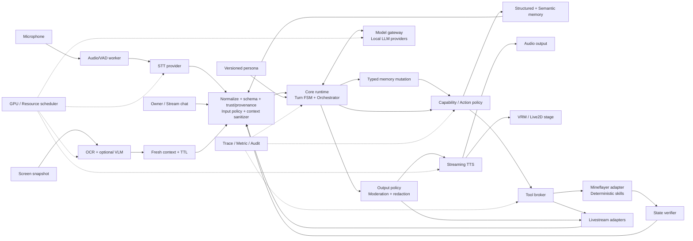
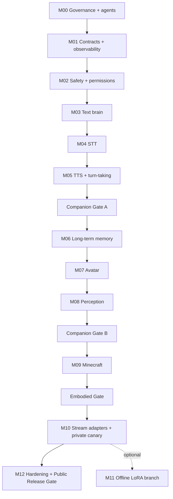

# Hina AI — Master Plan xây AI VTuber kiểu Neuro-sama

> Trạng thái: kế hoạch greenfield, chưa bắt đầu implementation  
> Nguồn đầu vào chính: `deep-research-report.md`  
> Mục tiêu phần cứng ban đầu: Windows, NVIDIA RTX 5070 Ti 16 GB; RAM/driver/runtime phải được xác minh lại ở M00  
> Nguyên tắc phát triển: một module sản phẩm tại một thời điểm; nhiều agent làm song song bên trong module; chỉ mở module kế tiếp sau khi module hiện tại qua toàn bộ quality gate

## Cách dùng tài liệu này

- Phần 1–7 chốt kiến trúc, contracts, stack và folder tree.
- Phần 8 chốt roster GPT-5.6 Sol/5.5/5.4 và cách các agent phối hợp.
- Phần 9–10 định nghĩa gate, SLO và evidence bắt buộc.
- Phần M00–M12 là thứ tự implementation; mỗi module có deliverables và acceptance gate.
- Phần 12–14 kiểm soát OSS, dữ liệu và security.
- Phần 15–21 là risk, Definition of Done, execution order và các quyết định cần chốt.

Khi bắt đầu code, chỉ lấy module active hiện tại làm scope. Không copy toàn bộ roadmap vào một prompt implementation.

## 1. Kết luận kiến trúc

Hina AI không nên là một model duy nhất làm mọi việc. Hệ thống sẽ là một virtual character có nhiều subsystem chuyên biệt:

- Lõi hội thoại và persona.
- STT/TTS streaming thời gian thực.
- Bộ nhớ ngắn hạn và dài hạn có consent, provenance và khả năng xóa.
- Avatar VRM/Live2D.
- Nhận thức màn hình theo snapshot/event, không chạy video VLM liên tục.
- Minecraft agent gồm high-level planner và low-level deterministic controller.
- Livestream/chat adapters có moderation, rate limit và emergency stop.
- Pipeline dữ liệu và LoRA/QLoRA chạy offline, có đánh giá và phê duyệt thủ công.

Kiến trúc triển khai ban đầu là **modular monolith + process adapters**:

- Python `asyncio` làm core runtime và các module nghiệp vụ.
- Electron + Vue/TypeScript làm desktop stage/operator UI.
- Python worker riêng cho speech/perception vì có dependency native/GPU.
- Node/TypeScript adapter riêng cho Mineflayer và platform integrations.
- Không dựng một mạng microservice dày, message broker hoặc Kubernetes ở giai đoạn đầu.
- Chỉ tách process tại biên ngôn ngữ, native runtime, GPU hoặc fault isolation thực sự cần thiết.

Đây là cách cân bằng tốt giữa khả năng copy/học từ AIRI, khả năng dùng thư viện Python cho AI, và việc giữ codebase đủ nhỏ để test được từng module.

## 2. Phạm vi sản phẩm

### 2.1 Đích đến

Hina AI cần đạt được theo thứ tự:

1. Nói chuyện text ổn định bằng tiếng Việt, persona nhất quán.
2. Nghe mic và trả lời bằng giọng nói với latency đủ tự nhiên.
3. Nhớ người dùng có chọn lọc, có thể xem/sửa/xóa ký ức.
4. Điều khiển avatar và biểu cảm đồng bộ với hội thoại.
5. Hiểu màn hình theo snapshot mới, không nhầm ảnh cũ là hiện tại.
6. Chơi Minecraft mức cơ bản, hành động có kiểm chứng bằng game state.
7. Đọc và phản hồi livestream chat an toàn.
8. Định kỳ huấn luyện LoRA/QLoRA từ dữ liệu đã lọc, không tự train online.
9. Chạy dài giờ, có monitoring, rollback và emergency stop.

### 2.2 Non-goals của phiên bản đầu

- Không sao chép model hoặc dataset riêng của Neuro-sama; các thành phần này không công khai.
- Không cho model tự sửa trọng số sau mỗi cuộc trò chuyện.
- Không cho LLM trực tiếp điều khiển phím/chuột ở tốc độ cao.
- Không chạy JavaScript, Python, shell hoặc code khác do LLM tự sinh như một skill production.
- Không tự động đưa public chat vào personality memory hoặc training dataset.
- Không clone giọng người thật nếu chưa có consent và giấy phép phù hợp.
- Không public livestream trước khi voice, memory, moderation, kill switch và soak test đạt gate.
- Không tối ưu cho nhiều game cùng lúc; Minecraft là domain game đầu tiên.

## 3. Các invariant không được phá

1. Base model được giữ frozen trong sử dụng hằng ngày.
2. Persona gốc là cấu hình được version hóa; memory không được âm thầm sửa identity.
3. Mọi input bên ngoài có `trustLevel`; public chat, web, OCR và game text đều là untrusted.
4. Mọi tool/action phải đi qua policy engine và schema validation.
5. Unknown capability hoặc schema không hợp lệ phải fail closed.
6. Minecraft: LLM chọn high-level goal; low-level controller deterministic; success phải có game-state evidence.
7. Observation màn hình có TTL; hết TTL thì không được đưa vào context.
8. Không phát hidden reasoning qua TTS hoặc log.
9. Local services mặc định chỉ bind `127.0.0.1`.
10. Secret không nằm trong Git, prompt, log, memory hoặc training data.
11. Luôn giữ khoảng 2 GB VRAM headroom trong workload phát sóng.
12. Optional GPU work như VLM hoặc training phải được resource scheduler cấp lease.
13. Code, model weights, dataset, voice và avatar asset có license/provenance riêng; license repo không tự động bao phủ weights/data/assets.
14. Module chỉ được chuyển sang `Done` dựa trên evidence của đúng commit hash.

## 4. Sơ đồ hệ thống



### 4.1 Luồng hội thoại chuẩn

```text
mic
→ VAD speech-start/speech-end
→ STT partial/final
→ turn manager
→ context composer (persona + memory + fresh observations)
→ model gateway
→ output moderation
→ TTS streaming
→ audio + viseme/emotion cues
→ avatar
```

### 4.2 Luồng tool/game chuẩn

```text
LLM proposes high-level intent
→ typed ToolInvocation
→ schema validation
→ PolicyDecision (allow | ask | deny)
→ adapter/controller
→ precondition check
→ bounded deterministic execution
→ postcondition/state verification
→ ToolResult with evidence
→ LLM may describe only the verified result
```

`Boundary`, `OutputPolicy` và capability policy là mandatory ports của orchestration; chúng có thể chạy in-process nhưng không được bypass. Contract test phải chứng minh không external/retrieved/tool content nào đi vào `ContextBundle` nếu thiếu schema validation, trust/provenance và sanitation evidence.

## 5. Giao thức và ranh giới module

### 5.1 Hai plane giao tiếp

- **Control plane:** REST/OpenAPI cho health, version, config, lifecycle và operator actions.
- **Realtime plane:** WebSocket cho event metadata/control; binary media dùng binary frame, shared-memory/file reference hoặc transport phù hợp, không base64 JSON mặc định.
- LiveKit chỉ được thêm ở giai đoạn voice room/multi-user; không đưa vào domain core của desktop single-user.
- Không thêm NATS/Kafka/Redis Streams trước khi benchmark chứng minh in-process/WebSocket không đủ.

QoS được chia rõ:

- **Ephemeral/latest-only, được drop:** audio frame, partial transcript, model token, viseme, preview frame/snapshot superseded.
- **Durable at-least-once:** tool invocation, consent/memory mutation, outbound public message, dataset/model promotion.
- **Request/response lifecycle:** health/config/operator command có deadline/cancellation rõ.

Durable command phải có `streamId`, `sequence`, `ack`, `resumeFrom`, `idempotencyKey` và được ghi vào SQLite command journal/outbox trước side effect. Consumer dùng inbox/idempotency ledger; reconnect resume từ ack cuối. WebSocket một mình không được coi là durable transport.

### 5.2 Event envelope v1

Mọi event qua process boundary phải có:

```yaml
schemaVersion: "1.x"
eventId: uuid
type: string
scope: global | session | turn
sessionId: uuid | null
turnId: uuid | null
correlationId: uuid
causationId: uuid | null
source: string
trustLevel: owner | trusted_local | authenticated | public | untrusted
occurredAt: RFC3339 timestamp
expiresAt: RFC3339 timestamp | null
deadline: RFC3339 timestamp | null
idempotencyKey: string | null
streamId: string | null
sequence: integer | null
payload: object
```

Ngữ nghĩa:

- Delivery có thể at-least-once; consumer có side effect phải idempotent.
- Queue phải bounded và có backpressure.
- Cancellation truyền xuyên STT → LLM → TTS → avatar/tool.
- Payload quá hạn không được dùng.
- Unknown event/tool/action không được tự động bỏ qua nếu có thể gây side effect.
- Event có `scope: global | session | turn`; `sessionId` nullable cho global health/resource event và bắt buộc theo schema discriminator cho session/turn event.
- Side-effect command bắt buộc có non-null `idempotencyKey`; ephemeral event không được ghi vào durable outbox.

### 5.3 Contract nguồn sự thật

`packages/contracts/schemas/v1/` là source of truth:

- JSON Schema cho event và data object.
- OpenAPI cho control plane.
- AsyncAPI hoặc tài liệu event catalog cho realtime plane.
- Generate Python Pydantic models và TypeScript Zod/types.
- Golden fixtures giữ compatibility giữa producer/consumer.

Contracts quan trọng:

- `AudioFrame`, `SpeechStarted`, `SpeechEnded`, `TranscriptPartial`, `TranscriptFinal`.
- `TurnRequest`, `TurnCancelled`, `ContextBundle` với sanitation/provenance evidence, `ModelToken`, `AssistantUtterance`.
- `TtsChunk`, `AudioAlignment`, `VisemeCue`, `AvatarCue`.
- `Observation` với `capturedAt`, `expiresAt`, `confidence`, `evidenceRef`.
- `MemoryCandidate`, `MemoryRecord`, `ConsentReceipt`, `DeletionReceipt`.
- `ToolInvocation`, `PolicyDecision`, `ToolResult`.
- `GameGoal`, `SkillInvocation`, `SkillResult`, `VerificationResult`.
- `StreamChatMessage`, `OutboundChatMessage`, `ModerationDecision`.
- `ResourceLease`, `ResourcePressure`, `ServiceHealth`.

### 5.4 Dependency direction

```text
contracts + config
  ← domain packages (persona, safety-policy, memory ports)
  ← core-runtime (orchestration depends on ports/interfaces)
  ← workers/adapters (implement ports; use generated contracts)
  ← desktop (uses TypeScript contracts/client only)
```

Quy tắc:

- Không có dependency vòng.
- Vendor types không được rò vào core.
- Domain package chỉ phụ thuộc contracts/config và explicit port; adapter không phụ thuộc ngược vào core implementation.
- Module không đọc trực tiếp database/table của module khác.
- Shared package chỉ chứa primitive thật sự dùng chung, không biến thành “utils” vô chủ.
- Thay contract là thay đổi kiến trúc và chỉ main orchestrator/contracts owner được duyệt.

## 6. Stack công nghệ dự kiến

Đây là default để bắt đầu; M00 phải ghi ADR và benchmark trước khi freeze:

| Lớp | Lựa chọn ban đầu | Lý do |
|---|---|---|
| Monorepo JS | `pnpm` workspace | Phù hợp Electron/Vue/Mineflayer và dễ dùng source AIRI |
| Monorepo Python | `uv` + `pyproject.toml` | Lock nhanh, môi trường tái lập |
| Core runtime | Python 3.12+, `asyncio`, FastAPI/WebSocket | Thuận lợi cho AI pipeline và service contracts |
| Desktop | Electron + Vue 3 + TypeScript | Hợp mô hình AIRI và hệ sinh thái VRM/Live2D |
| LLM runtime | Local OpenAI-compatible gateway; Ollama là baseline | Provider thay được, dễ benchmark trên Windows |
| Runtime model | Qwen3.5 4B class làm baseline; 9B manual fallback/benchmark | Chừa VRAM cho speech, avatar và snapshot VLM |
| STT | faster-whisper sau benchmark model/quantization | Streaming tốt, footprint thấp |
| VAD | Silero VAD hoặc WebRTC VAD qua interface | Có thể A/B theo giọng Việt và noise |
| TTS | Benchmark VieNeu/Kokoro/Piper/MMS tiếng Việt | Tách latency, độ tự nhiên và license |
| Memory | SQLite + Qdrant | Structured truth + semantic retrieval |
| Perception | Event-driven capture + PaddleOCR + optional VLM snapshot | Tránh video VLM liên tục |
| Minecraft | Mineflayer + typed deterministic skills | Low-level state/action ổn định |
| Tests Python | pytest, Hypothesis, coverage, Ruff, type checker | Unit/property/contract |
| Tests TS/UI | Vitest, Playwright, ESLint, `vue-tsc` | Component/E2E desktop |
| Observability | Structured JSON logs + per-turn traces + metrics | Reproduce latency/failure |
| Packaging | Windows-first; installer chỉ làm sau hardening | Không khóa sớm vào distribution |

Model cụ thể không được promote chỉ vì model card tốt. Mọi model phải đi qua cùng eval suite, đo TTFT, tokens/s, chất lượng tiếng Việt, safety và peak VRAM.

Báo cáo nghiên cứu gợi ý 8B class cho hệ luôn-on; kế hoạch chọn 4B làm **baseline bảo thủ** để còn VRAM cho STT/TTS/avatar/VLM. 7–8B vẫn là candidate và có thể thay baseline nếu thắng eval mà vẫn giữ `min_free_vram_mib >= 2048`. 9B chỉ là manual fallback/benchmark, không tự động giữ resident cùng full stack.

## 7. Cấu trúc folder greenfield

```text
ProjectHinaAI/
├─ AGENTS.md
├─ README.md
├─ LICENSE
├─ SECURITY.md
├─ CONTRIBUTING.md
├─ pyproject.toml
├─ uv.lock
├─ package.json
├─ pnpm-workspace.yaml
├─ pnpm-lock.yaml
├─ .editorconfig
├─ .gitignore
├─ .env.example
│
├─ .codex/
│  ├─ config.toml
│  └─ agents/
│     ├─ architecture-contracts.toml
│     ├─ oss-researcher.toml
│     ├─ module-builder.toml
│     ├─ qa-designer.toml
│     ├─ qa-runner.toml
│     ├─ safety-reviewer.toml
│     └─ integration-release.toml
│
├─ apps/
│  ├─ core-runtime/
│  │  ├─ src/hina_core/
│  │  │  ├─ orchestration/
│  │  │  ├─ turns/
│  │  │  ├─ prompting/
│  │  │  ├─ context/
│  │  │  ├─ tools/
│  │  │  ├─ lifecycle/
│  │  │  └─ api/
│  │  └─ tests/
│  ├─ desktop/
│  │  ├─ src/
│  │  │  ├─ main/
│  │  │  ├─ renderer/
│  │  │  ├─ capture/
│  │  │  ├─ stage/
│  │  │  ├─ operator/
│  │  │  ├─ settings/
│  │  │  └─ ipc/
│  │  └─ tests/
│  └─ dev-console/
│     ├─ src/
│     └─ tests/
│
├─ workers/
│  ├─ speech/
│  │  ├─ src/hina_speech/
│  │  │  ├─ audio/
│  │  │  ├─ vad/
│  │  │  ├─ stt/
│  │  │  ├─ tts/
│  │  │  ├─ alignment/
│  │  │  └─ providers/
│  │  └─ tests/
│  └─ perception/
│     ├─ src/hina_perception/
│     │  ├─ capture_pipeline/
│     │  ├─ crop/
│     │  ├─ dedup/
│     │  ├─ ocr/
│     │  ├─ vlm/
│     │  └─ freshness/
│     └─ tests/
│
├─ adapters/
│  ├─ minecraft/
│  │  ├─ src/
│  │  │  ├─ mineflayer/
│  │  │  ├─ controller/
│  │  │  ├─ skills/
│  │  │  ├─ planner-bridge/
│  │  │  ├─ verification/
│  │  │  └─ safety/
│  │  └─ tests/
│  ├─ stream/
│  │  ├─ src/
│  │  │  ├─ youtube/
│  │  │  ├─ twitch/
│  │  │  ├─ tiktok/
│  │  │  ├─ normalize/
│  │  │  ├─ policy-enforcement/       # gọi safety-policy authority
│  │  │  └─ rate-limit/
│  │  └─ tests/
│  └─ livekit/                       # optional, chỉ thêm khi có multi-user voice
│
├─ packages/
│  ├─ contracts/
│  │  ├─ schemas/v1/
│  │  ├─ openapi/
│  │  ├─ asyncapi/
│  │  ├─ fixtures/
│  │  └─ generated/
│  │     ├─ python/
│  │     └─ typescript/
│  ├─ model-gateway/
│  ├─ persona/
│  ├─ memory/
│  ├─ safety-policy/
│  ├─ resource-scheduler/
│  ├─ observability/
│  ├─ config/
│  └─ testkit/
│
├─ ml/
│  ├─ prompts/
│  │  ├─ persona/
│  │  ├─ conversation/
│  │  ├─ reflection/
│  │  └─ game/
│  ├─ models/
│  │  └─ manifests/
│  ├─ datasets/
│  │  ├─ manifests/
│  │  ├─ raw/                        # gitignored
│  │  ├─ staged/                     # gitignored
│  │  ├─ curated/                    # data gitignored; manifests tracked
│  │  └─ eval/                       # chỉ synthetic/redacted fixtures + manifests
│  ├─ training/
│  │  ├─ lora/
│  │  ├─ export/
│  │  └─ promotion/
│  └─ evals/
│     ├─ conversation/
│     ├─ speech/
│     ├─ memory/
│     ├─ vision/
│     ├─ minecraft/
│     └─ moderation/
│
├─ assets/
│  ├─ manifests/
│  ├─ avatars/                       # binary assets theo license policy
│  ├─ motions/
│  └─ voices/                        # gitignored nếu chứa owner audio/weights
│
├─ configs/
│  ├─ base/
│  ├─ profiles/
│  │  ├─ development/
│  │  ├─ private/
│  │  └─ livestream/
│  ├─ personas/
│  └─ policies/
│
├─ tests/
│  ├─ contracts/
│  ├─ component/
│  ├─ integration/
│  ├─ e2e/
│  ├─ replay/
│  ├─ performance/
│  ├─ soak/
│  ├─ chaos/
│  ├─ security/
│  ├─ fixtures/
│  └─ golden/
│
├─ infra/
│  ├─ compose/
│  ├─ qdrant/
│  ├─ observability/
│  └─ livekit/                       # optional/later
│
├─ docs/
│  ├─ architecture/
│  ├─ adr/
│  ├─ modules/
│  ├─ runbooks/
│  ├─ threat-model/
│  ├─ provenance/
│  ├─ test-reports/
│  └─ benchmarks/
│
├─ third_party/
│  ├─ THIRD_PARTY_NOTICES.md
│  ├─ code.lock.json
│  └─ patches/
│
├─ tools/
│  ├─ dev/
│  ├─ bench/
│  ├─ license/
│  ├─ sbom/
│  └─ release/
│
├─ artifacts/                        # raw output gitignored; tracked summary/hash
│  └─ verification/
└─ var/                              # toàn bộ gitignored
   ├─ cache/
   ├─ models/
   ├─ logs/
   ├─ data/
   └─ backups/                       # local convenience only; DR target ở disk/store khác
```

### 7.1 Workspace/package manifest

- Root `pyproject.toml` khai báo `uv` workspace members; mỗi Python deployable/package có `pyproject.toml`, `src/<package>/` và tests riêng.
- Root `pnpm-workspace.yaml` khai báo Electron/TypeScript apps, adapters và packages; mỗi member có `package.json`.
- `packages/contracts/schemas` là source of truth, nhưng generated output được publish thành hai package riêng:
  - Python: `hina-contracts`.
  - TypeScript: `@hina/contracts`.
- `model-gateway`, `persona`, `memory`, `safety-policy`, `resource-scheduler`, `observability` và `config` phải ghi rõ language/manifest; không import bằng relative path xuyên Python/TypeScript ecosystem.
- Generated code chỉ thay đổi qua contract generation job; agent không sửa tay.

### 7.2 Capture ownership

- M04: speech worker sở hữu microphone/device lifecycle qua audio interface; chưa phụ thuộc Electron.
- M08: Electron **main process** sở hữu OS screen-capture permission và gửi binary frame/reference tới perception worker.
- Perception worker chỉ crop/dedup/OCR/VLM/freshness; không tự xin permission UI.
- Electron renderer chỉ điều khiển/preview, không giữ quyền capture hoặc persistence.
- Screen/audio capture có lifecycle, scope và consent contract riêng.

### 7.3 Ownership quan trọng

- Root config, lockfiles, `packages/contracts`, release manifest: main/integration owner.
- `apps/core-runtime`: core builder.
- `workers/speech`: speech builder.
- `packages/memory`: memory builder.
- `workers/perception`: perception builder.
- `adapters/minecraft`: game builder.
- `adapters/stream`: stream builder.
- Test/eval agent không sửa production path khi đang ở independent-review wave.

## 8. Đội Codex đa-agent

### 8.1 Nguyên tắc

- GPT-5.6 Sol là **Primary Orchestrator đồng thời là builder/integration owner mặc định**.
- Main giữ requirements, dependency graph, contracts, trực tiếp triển khai phần lớn
  vertical slice và quyết định pass/fail/promotion.
- GPT-5.5 đảm nhận công việc cần reasoning sâu, kiến trúc, implementation và security.
- GPT-5.4 đảm nhận OSS research, test/eval, replay, benchmark và tài liệu có scope rõ.
- Agent là opt-in theo rủi ro, không phải wave bắt buộc. Mặc định không spawn;
  tối đa hai subagent đồng thời khi nhiệm vụ độc lập và tiết kiệm thời gian thật.
- Mỗi agent nhận context packet nhỏ gồm brief, diff/symbol và test liên quan;
  không cold-read toàn repository hoặc toàn master plan.
- Parallelism ưu tiên read-heavy; write-heavy được serialize hoặc tách worktree/owned paths tuyệt đối.
- Không agent nào tự review và tự duyệt code của chính nó.
- GPT-5.6 Sol là release coordinator/recommender, không phải human approval authority.
- Chỉ owner được duyệt public livestream, model/adapter promotion, voice cloning, license exception và risk waiver.

### 8.2 Roster

| Role | Model / effort | Chế độ | Trách nhiệm |
|---|---|---|---|
| Primary Orchestrator | `gpt-5.6-sol`, `high` | danger-full-access, never ask | Chốt scope/contract, trực tiếp code và tích hợp, chọn reviewer theo rủi ro, quyết định gate |
| `architecture_contracts` | `gpt-5.5`, `high` | read-only | Boundary/schema có blast radius lớn; không chạy mặc định |
| `oss_researcher` | `gpt-5.4`, `medium` | read-only | Tìm upstream, xác minh commit/license, chỉ ra phần tham khảo/copy |
| `module_builder` | `gpt-5.5`, `medium` | workspace-write | Chỉ nhận implementation bounded hoặc subtree/worktree không giao nhau |
| `qa_designer` | `gpt-5.4`, `medium` | read-only | Test matrix cho acceptance khó, adversarial hoặc safety-critical |
| `qa_runner` | `gpt-5.4`, `medium` | workspace-write ở validation worktree | Chạy đúng command trên frozen SHA; không đọc lại toàn kiến trúc |
| `safety_reviewer` | `gpt-5.5`, `high` | read-only | Review diff ảnh hưởng trust/privacy/action/provenance |
| `integration_release` | `gpt-5.5`, `medium` | workspace-write | Chỉ assemble evidence lớn khi primary giao rõ |

### 8.3 Cấu hình dự kiến

`.codex/config.toml`:

```toml
model = "gpt-5.6-sol"
model_reasoning_effort = "high"
sandbox_mode = "danger-full-access"
approval_policy = "never"

[agents.architecture_contracts]
description = "Defines architecture, boundaries, contracts, ADRs, and migration constraints."
config_file = "agents/architecture-contracts.toml"

[agents.module_builder]
description = "Implements one approved module inside an exclusive write lease."
config_file = "agents/module-builder.toml"

# Các role còn lại được khai báo cùng dạng và trỏ tới `.codex/agents/*.toml`.
```

Codex CLI 0.144.6 trên máy dự án parse `[agents]` như bảng khai báo role. Vì vậy
M00 không đặt scalar global trong bảng này: bảy role được khai báo bằng
`[agents.<role>]`, còn giới hạn hai worker opt-in được enforce bởi `AGENTS.md` và
orchestrator. Model/effort được pin trong từng `.codex/agents/*.toml`; không dựa
vào inheritance ngầm. Thay đổi cú pháp chỉ được thực hiện sau khi `codex doctor`
và smoke-test config mới đều pass.

Ví dụ `architecture-contracts.toml`:

```toml
name = "architecture_contracts"
description = "Thiết kế contract và boundary cho một module trước implementation."
model = "gpt-5.5"
model_reasoning_effort = "high"
sandbox_mode = "read-only"
developer_instructions = """
Chỉ làm việc khi nhận Module Brief có module_id, base_sha và owned_paths.
Thiết kế interface, event/schema, invariants, failure modes, acceptance criteria và ADR.
Không sửa file, không mở rộng scope, không spawn agent khác.
Trả kết quả theo AGENT_RESULT contract của repository.
"""
```

Ví dụ `module-builder.toml`:

```toml
name = "module_builder"
description = "Writer duy nhất triển khai module đã có contract được duyệt."
model = "gpt-5.5"
model_reasoning_effort = "medium"
sandbox_mode = "workspace-write"
developer_instructions = """
Chỉ sửa owned_paths trong Module Brief.
Không thay contract/dependency nếu chưa báo BLOCKED và được orchestrator duyệt.
Viết production code cùng unit/contract tests.
Không reset, xóa hoặc ghi đè thay đổi ngoài scope. Không spawn agent khác.
Trả changed_files, commands, test evidence, provenance và unresolved risks.
"""
```

### 8.4 Preflight model bắt buộc

Trước khi bootstrap cấu hình:

1. Xác nhận `gpt-5.6-sol`, `gpt-5.5`, `gpt-5.4` có trong model picker/catalog của tài khoản Codex.
2. Smoke-test từng custom agent bằng một task read-only.
3. Xác nhận role thực tế dùng đúng model và reasoning.
4. Không silent fallback. Nếu model không có entitlement, dừng và ghi blocker để chủ dự án chọn model thay thế.
5. Xác nhận project đã trusted để `.codex/` được áp dụng.
6. Ghi effective permission mode; agent-file `sandbox_mode` chỉ là default và có thể bị live composer/CLI override.
7. M00 chọn một cơ chế permission nhất quán; không trộn permission profile mới với `sandbox_mode` cũ.
8. Role cần isolation cứng chạy trong session/worktree riêng với permission explicit.
9. Owner đã chọn `danger-full-access` + `approval_policy = "never"` cho primary
   5.6 Sol. Custom agent vẫn pin sandbox riêng và không được kế thừa quyền này.
10. Project config không thể vượt managed/admin policy của Codex host; runtime
    phải ghi effective permission nếu khác cấu hình dự án.

Preflight ngày 2026-07-23 với Codex CLI 0.144.6 cho thấy local model catalog có `gpt-5.6-sol`, `gpt-5.5` và `gpt-5.4`. Catalog visibility chưa chứng minh custom-agent spawn/auth/permission sẽ thành công, nên smoke-test vẫn là gate bắt buộc.

### 8.5 Luật trong `AGENTS.md`

Root `AGENTS.md` khi bootstrap phải quy định:

1. Chỉ primary orchestrator được spawn/steer subagent.
2. Mỗi task phải có `MODULE_BRIEF`.
3. Tối đa một writer trên một worktree tại một thời điểm.
4. Agent chỉ sửa `owned_paths`; phần còn lại là read-only.
5. Không mở implementation module kế tiếp trước khi module hiện tại qua Gate 6.
6. Có thể nghiên cứu/test-design module kế tiếp ở read-only, nhưng không code trước.
7. Mọi code OSS copy/adapt phải có provenance và license.
8. License code, weights, dataset, voice, avatar được kiểm tra riêng.
9. Không copy code không license hoặc license chưa được duyệt.
10. Không commit secret, dữ liệu người dùng thật hoặc memory chưa consent.
11. Mọi tuyên bố pass phải có command, commit và artifact evidence.
12. Finding phải có severity, file/symbol, reproduction và closing criteria.

### 8.6 Handshake giữa main và agent

Advisory agent nhận context packet rút gọn chỉ gồm objective, non-goals,
base/diff, file liên quan, acceptance và output format. Không gửi toàn bộ roadmap.
Writer hoặc frozen-SHA gate agent mới nhận `MODULE_BRIEF` đầy đủ:

```yaml
MODULE_BRIEF:
  module_id: M03
  objective: ...
  non_goals: [...]
  base_sha: ...
  branch: module/M03-...
  worktree: ...
  owned_paths: [...]
  forbidden_paths: [...]
  frozen_contracts: [...]
  allowed_dependencies: [...]
  oss_candidates: [...]
  acceptance_criteria: [...]
  required_test_commands: [...]
  latency_or_quality_budget: [...]
  output_artifact_dir: artifacts/verification/M03/
```

Advisory agent trả kết luận ngắn, finding và closing criteria. Chỉ writer hoặc
frozen-SHA gate agent trả `AGENT_RESULT` đầy đủ:

```yaml
AGENT_RESULT:
  schema_version: "1.0"
  task_id: ...
  role: module_builder
  module_id: M03
  status: passed
  brief_sha256: ...
  base_sha: ...
  head_sha: ...
  tree_hash: ...
  git_status: ...
  runtime:
    codex_version: ...
    model_slug: ...
    reasoning_effort: ...
    sandbox_mode: ...
    effective_sandbox_mode: ...
    approval_policy: untrusted | on-request | never
    permission_source: project_config | agent_file | live_override
    cwd: ...
    worktree_root: ...
    branch: ...
    observed_base_sha: ...
  changed_files: [...]
  decisions: [...]
  commands_run: [...]
  tests:
    passed: [...]
    failed: [...]
  provenance:
    - source_url: ...
      revision: ...
      license: ...
      copied_or_adapted_files: [...]
  risks: [...]
  blockers: [...]
  recommended_next_action: ...
```

`MODULE_BRIEF` và `AGENT_RESULT` phải có JSON Schema version hóa; CI validate trước Gate 2–6. Main reject kết quả nếu runtime/worktree/model/permission không khớp brief/roster. Main chỉ nạp summary và đường dẫn artifact; raw logs không đổ toàn bộ vào main context.

### 8.7 Lean flow cho từng module

1. Main chốt brief, acceptance tests và scope.
2. Main chỉ spawn tối đa hai advisory agent khi có trigger rõ: boundary/schema
   lớn, dependency/OSS mới, hoặc acceptance khó/safety-critical.
3. Main trực tiếp triển khai vertical slice và dùng test hẹp trong vòng lặp code.
4. Candidate sạch chạy full suite một lần rồi freeze SHA.
5. Chọn một independent reviewer theo rủi ro; thêm `qa_runner` chỉ khi acceptance
   cần repeat, benchmark, replay hoặc fault evidence.
6. Chỉ P0/P1 hoặc acceptance failure mở lại implementation. P2/P3 vào backlog
   trừ khi main ghi rõ lý do chặn release.
7. Repeat/flake/soak chỉ chạy một lần trên frozen SHA cuối. Sau patch blocker,
   reviewer chỉ đọc diff mới thay vì đọc lại toàn module.
8. Primary assemble evidence và push. `integration_release` chỉ dùng khi khối
   evidence độc lập đủ lớn để chi phí handoff có lợi.

Chi tiết và trigger của từng role được chốt tại ADR-0006.

### 8.8 Branch/worktree

```text
main
module/MNN-<slug>
integration/MNN-<slug>
../ProjectHinaAI-wt-MNN-<slug>
```

- Bootstrap phải `git init` và có baseline commit trước khi tạo worktree.
- Main là người duy nhất merge/cherry-pick.
- Worker không reset/rebase/merge `main`.
- Không hai agent cùng sửa schema, lockfile, root config hoặc generated code.
- Subagent spawn trong cùng Codex task mặc định dùng cùng checkout; chỉ một writer được phép.
- True parallel write chỉ dùng với Codex task/session riêng khởi chạy trực tiếp trên managed worktree riêng, khác branch, contract đã freeze và `owned_paths` không giao nhau.
- Trước write lease, main kiểm `git rev-parse --show-toplevel`, `git branch --show-current`, `git rev-parse HEAD`; agent trả lại giá trị quan sát thực tế trong `AGENT_RESULT`.
- Nếu primary orchestrator sửa tracked file, diff đó phải được agent độc lập review trên frozen SHA; quyền Gate 6 không thay independent review.

## 9. Quality gate chung

### 9.1 Test pyramid

Tỷ lệ định hướng:

- 60–70% unit/property tests: deterministic, không cần network/model/GPU.
- 20–25% contract/component tests: service thật với dependency giả hoặc recorded fixture.
- 10–15% integration/E2E: nhiều service và model thật.
- Bên ngoài pyramid: benchmark, security red-team, chaos, soak và human evaluation.

Mọi bug tìm thấy ở E2E phải được hạ xuống thành regression test ở tầng thấp nhất có thể.

### 9.2 Sáu bằng chứng để một module được `Done`

1. Contract/schema và ADR đã version hóa.
2. Unit, property, contract và component tests đều xanh.
3. Integration/E2E liên quan đều xanh.
4. Latency, VRAM, RAM, quality và reliability benchmark được lưu dạng machine-readable.
5. Threat cases, privacy, license/provenance và rollback đã được kiểm chứng.
6. Agent độc lập với agent viết code xác nhận kết quả trên đúng commit SHA.

### 9.3 Gate tuần tự

- **Gate 0 — Brief ready:** scope, non-goals, owner, dependency, OSS candidates, acceptance criteria.
- **Gate 1 — Contract ready:** interface/schema, invariants, failure modes, ADR và test matrix được duyệt.
- **Gate 2 — Builder pass:** lint, format, typecheck, unit/property/contract tests xanh.
- **Gate 3 — Independent QA:** negative tests, replay, race, cancellation, failure recovery, flakiness.
- **Gate 4 — Safety/license:** security, privacy/consent, prompt/tool abuse, provenance và SBOM.
- **Gate 5 — Integration:** cross-module suite, E2E, benchmark, risk-proportional stress/soak và rollback rehearsal khi liên quan. Component nhỏ chạy 15–30 phút stress; Companion/Embodied milestone 8 giờ; Public Release 24 giờ. Mục không áp dụng ghi `N/A + rationale`.
- **Gate 6 — Promotion:** artifact đầy đủ, worktree sạch, finding đã đóng hoặc có ADR chấp nhận rủi ro.

Không được mở write phase của module kế tiếp khi Gate 6 chưa pass.

### 9.4 Stop-the-line

Dừng merge/chuyển phase hoặc rollback ngay nếu:

- Contract breaking không có major version/migration.
- Bất kỳ must-pass test nào đỏ.
- Must-pass suite có failure không giải thích được hoặc rolling CI flaky rate >1%.
- GPU OOM hoặc VRAM headroom dưới 2 GB ở workload chuẩn.
- Safety/moderation critical miss.
- Tool/action không allowlist được thực thi.
- Minecraft action thiếu postcondition verification.
- Memory cross-user leak, consent fail hoặc deletion không hoàn tất.
- Production service bind ngoài loopback khi chưa có auth/threat model.
- License/provenance của code, weights, dataset, voice hoặc avatar không rõ.
- Rollback rehearsal thất bại.
- Public stream chưa có emergency mute/kill switch.
- LoRA rò PII, memorization hoặc giảm safety.
- Benchmark thiếu commit/model/config/driver hash nên không tái lập được.

### 9.5 Waiver và flaky policy

- Không waiver P0/P1, stop-the-line, safety/privacy/consent/license critical, rollback failure hoặc unknown provenance.
- P2 chỉ được waiver bởi owner, có expiry date, compensating control đã test và tracking issue.
- Must-pass deterministic suite: 20 lần liên tiếp trên frozen SHA, 0 failure.
- Race/cancellation suite: tối thiểu 100 repetitions.
- Flaky rate ≤1% lấy từ rolling CI history; không suy ra từ ba lần chạy.
- Một failure không giải thích được trong must-pass suite chặn promotion.

## 10. SLO và benchmark ban đầu

Các ngưỡng dưới đây là mục tiêu v0. M00/M01 phải đo baseline trên máy thật rồi ghi ADR nếu cần điều chỉnh.

Safety/correctness/privacy threshold không được nới bằng ADR. Performance threshold chỉ được sửa trước khi mở module phụ thuộc, cần owner approval và phải giữ kết quả cũ/mới.

Protocol đo chuẩn:

- Mỗi latency suite: ≥20 warm-up + ≥200 measured turns; báo p50/p95/p99 và bootstrap CI 95%.
- NVML sample mỗi 100 ms; `min_free_vram_mib >= 2048` trong measured all-on window.
- `peak_total_process_working_set_gib <= 26`; ghi thêm system commit và hard page faults/second.
- TTS first-audio: từ lúc chunk đã moderation-pass tới PCM đầu tiên.
- Speech-end → first audio: từ VAD endpoint tới PCM tại output device.
- Barge-in: từ interrupt event nhận ở core tới audio/local side effect dừng.
- Mọi metric quality phải trỏ tới versioned dataset manifest, normalization/scoring script, sample size và confidence interval khi áp dụng.

### 10.1 Voice latency

Với audio đầu vào không quá 10 giây:

| Chỉ số | Target ban đầu |
|---|---:|
| VAD endpoint detection p95 | ≤350 ms |
| STT final sau endpoint p95 | ≤800 ms |
| LLM warm TTFT p95 | ≤900 ms |
| LLM generation p5 | ≥25 token/s |
| TTS first audio p95 | ≤500 ms |
| Speech-end → first audio, voice-only p50 | ≤1,8 s |
| Speech-end → first audio, voice-only p95 | ≤3,0 s |
| Speech-end → first audio, all-on p95 | ≤3,5 s |
| Memory retrieval p95 | ≤150 ms |
| Lip-sync offset p95 | ≤100–120 ms |
| Barge-in cancel p95 | ≤250 ms |

### 10.2 Resource

- VRAM trống luôn ≥ khoảng 2 GB trong all-on workload.
- Không GPU OOM trong soak.
- Toàn stack nên dùng ≤26 GB RAM trên máy 32 GB và không pagefile thrashing kéo dài.
- Benchmark tách cold start, warm start và transient peak.
- Resource scheduler ưu tiên:

```text
active conversation
→ STT/TTS
→ avatar render
→ VLM snapshot
→ offline eval/training
```

- Khi VRAM pressure, VLM phải chờ/unload hoặc fallback OCR; training không được chạy cùng livestream.

### 10.3 Reliability

- 1.000 scripted turns: ≥99,5% hoàn tất; 0 deadlock, 0 corrupt state, 0 duplicate side effect.
- Desktop soak tối thiểu 8 giờ: 0 crash.
- Trước private stream: 8 giờ với workload stream giả lập.
- Trước public stream: supervised soak 24 giờ.
- Required service restart/recover ≤10 giây.
- Restart/reconnect không được lặp câu đã phát hoặc action đã thực hiện.
- Runtime auto-rollback trigger: safety incident, OOM hoặc secret leak bất kỳ; turn error rate >1% trong 5 phút; p95 latency xấu hơn >20% baseline trong 10 phút; audit corruption hoặc duplicate side effect >0.

### 10.4 Workload chuẩn

1. Text-only.
2. Voice conversation.
3. Voice + avatar.
4. Voice + burst VLM snapshot.
5. Voice + Minecraft.
6. Full livestream simulation.
7. Offline mode với network bị chặn.

Mỗi benchmark lưu:

```text
commit SHA
model/weight hash
runtime/provider versions
prompt/persona/config version
driver/CUDA/OS
workload fixture hash
p50/p95/p99
peak VRAM/RAM
error taxonomy
```

## 11. Roadmap module-by-module

## M00 — Governance, Git và hệ điều hành đa-agent

### Mục tiêu

Biến thư mục rỗng thành repo có luật, toolchain, CI, ownership và evidence format trước khi code tính năng.

### Deliverables

- `git init`, default branch, baseline commit.
- Root `AGENTS.md`, `.codex/config.toml`, custom agents.
- Python `uv` và Node `pnpm` workspace/lockfiles.
- `.gitignore`, `.env.example`, secret policy.
- CI Windows cho lint/typecheck/unit smoke.
- Templates: `MODULE_BRIEF`, `AGENT_RESULT`, ADR, threat model, benchmark report.
- `third_party/code.lock.json`, `THIRD_PARTY_NOTICES.md`, model/asset manifests và SBOM/license scan.
- Project license và policy đóng góp.
- Hardware inventory script: CPU, RAM, GPU, VRAM, driver, CUDA/runtime, audio devices.

### Agent wave

- 5.5 architecture: ADR, boundaries, ownership.
- 5.4 OSS: dependency/license inventory.
- 5.4 QA: clean-checkout and CI smoke design.
- 5.6 Sol: chốt stack và bootstrap.

### Gate

- Clone/checkout sạch có thể setup và chạy smoke test bằng lệnh tài liệu hóa.
- Không secret hoặc runtime data bị track.
- Multi-agent role smoke-test đúng model/sandbox; không silent fallback.
- CI xanh trên Windows.
- License/SBOM job sinh artifact.
- Baseline commit tồn tại trước khi dùng worktree.

### Không làm

- Chưa cài model lớn.
- Chưa viết core conversation.
- Chưa copy production code từ upstream.

---

## M01 — Contracts, config, lifecycle và observability spine

### Mục tiêu

Tạo xương sống để mọi module sau có thể phát triển độc lập bằng fake provider và contract test.

### Deliverables

- Event envelope v1 và contract catalog.
- Python/TypeScript generated models.
- Control plane health/version/config.
- Realtime WebSocket event transport.
- QoS classes, binary-media transport, durable command journal/outbox/inbox, ACK/resume.
- Service registry/supervisor và graceful startup/shutdown.
- Bounded queue, deadline, cancellation, idempotency primitives.
- Per-turn trace, structured logs, metric API.
- `ResourceLease` contract, resource inventory API và fake scheduler.
- Fake model/speech/memory/tool providers trong `packages/testkit`.
- Replay harness nhận event fixture và tái hiện turn.

### Test matrix

- Schema validation với field thiếu/sai type/payload quá lớn/Unicode.
- Property/fuzz test.
- Golden compatibility v1 và n-1.
- Producer-consumer TS ↔ Python.
- Duplicate, out-of-order, expired và cancelled events.
- Disconnect/resume, missing ACK, journal replay và duplicate durable command.
- Burst/drop policy theo từng QoS; binary frame không bị nhét base64 vào JSON.
- Crash/restart giữa event stream.
- Secret/redaction test cho logs.

### Gate

- 100% process boundary validate runtime.
- Unknown tool/event fail closed.
- Breaking schema bị CI chặn.
- Replay cùng `idempotencyKey` không tạo side effect lần hai.
- Durable command không mất qua crash/reconnect; ephemeral stream được drop theo policy đã contract hóa.
- Queue max/dead-letter/drop policy được config; burst không làm RAM tăng vô hạn.
- Sau 100 start/stop, handle/thread/task count trở về baseline trong ngưỡng đã định.
- Generated model round-trip TS ↔ Python không mất dữ liệu.
- Health và graceful shutdown ổn định qua 100 vòng start/stop.

---

## M02 — Safety, permissions, moderation và audit

### Mục tiêu

Xây hàng rào trước khi cho LLM hoặc external input chạm tới tool, memory, TTS hay stream output.

### Deliverables

- Capability manifest version hóa.
- `allow | ask | deny` policy.
- Risk level, rate limit, budget, expiry và revocation.
- Input trust labels và prompt-boundary rules.
- Pre-tool, pre-TTS và pre-outbound-chat moderation.
- Secret/PII redaction.
- Immutable-enough audit trail với correlation ID.
- Operator emergency stop/mute.
- Feature flags để tắt memory promotion, perception, game action và stream output.

### Test matrix

- Unknown/expired/revoked capability.
- Prompt injection tiếng Việt/Anh, Unicode obfuscation.
- Oversized payload, replay, rate-limit bypass.
- Secret in prompt/tool result/log.
- Emergency stop khi LLM/TTS/tool đang stream.
- False positive/false negative moderation suite.
- Policy engine timeout/crash trong input, tool, TTS và outbound path.
- Context-boundary contract: untrusted input thiếu sanitation evidence không thể tạo `ContextBundle`.

### Gate

- Unknown/expired capability deny 100%.
- Policy timeout/crash làm tool/TTS/outbound fail closed; e-stop vẫn hoạt động khi core/event bus bị treo.
- 0 execution từ model-generated shell/JS/Python.
- 0 hidden reasoning đi vào TTS.
- Must-block critical suite: 0 miss.
- Emergency stop/mute p95 ≤250 ms.
- Audit đủ truy vết nhưng không chứa secret/raw sensitive audio.
- Local service chỉ bind loopback.

---

## M03 — Text brain: model gateway, turn FSM, persona và short-term memory

### Mục tiêu

Hoàn thành vertical slice text-only có persona Hina, interruption/cancellation, model thay được và không cần speech/UI thật.

### Deliverables

- Model gateway OpenAI-compatible/Ollama adapter.
- Streaming tokens, timeout, retry, circuit breaker.
- Turn FSM: idle/listening/thinking/speaking/interrupted/error.
- Context composer.
- Immutable persona spec + dynamic session relationship state.
- Conversation-window short-term memory.
- Tool proposal chỉ ở dạng typed intent; chưa cho action nguy hiểm.
- Dev console để chat/replay.
- Prompt/persona versioning.
- Real local resource scheduler: inventory, NVML telemetry, lease admission, priority, timeout, preemption/unload policy.

### Eval

- 200+ golden conversation cases tiếng Việt.
- Persona consistency, contradiction, refusal, code-switching.
- Prompt injection và tool-call malformed cases.
- Context overflow, model unavailable, partial stream, cancellation.
- Owner instruction precedence.
- No-current-vision claims khi không có fresh observation.
- Concurrent lease, starvation, timeout, preemption và provider unload/reload.

### Gate

- Freeze `text-brain-eval-v1` trước khi chạy candidate.
- Golden behavior pass rate ≥90% trên 200+ cases; critical persona/safety invariants 100%.
- Tool-selection macro-average ≥95% trên synthetic typed-tool suite; dangerous-tool false allow = 0; báo riêng `none/abstain`, từng tool và risk class.
- 100% tool args schema-validated.
- Deterministic orchestration với fake model.
- Persona score dùng versioned rubric/scorer và blind owner sample; candidate sau baseline không giảm >2 điểm phần trăm.
- Model failure degrade có kiểm soát, không treo.
- Barge-in/cancel logic ở core đạt ≤250 ms với fake downstream.
- TTFT/tokens/s/VRAM baseline được lưu.
- Runtime model được chọn bằng eval, không chỉ theo cảm tính.
- Mọi GPU provider từ M03 trở đi phải có resource lease; provider không có lease bị từ chối.
- Resource pressure không làm conversation deadlock hoặc phá 2 GB headroom.

---

## M04 — Speech input: audio capture, VAD và STT

### Mục tiêu

Nghe giọng chủ máy ổn định, ưu tiên tiếng Việt, không tự bịa transcript từ silence/noise.

### Deliverables

- Audio device abstraction và capture pipeline.
- Resample/channel normalization.
- VAD provider abstraction.
- faster-whisper provider.
- Partial/final transcript events.
- Vietnamese language lock/config.
- Device reconnect và backpressure.
- Raw-audio retention off mặc định.
- GPU-backed STT chỉ load/infer khi có `ResourceLease`; có CPU/degraded fallback theo profile.

### Corpus

- Giọng Bắc/Trung/Nam.
- Giọng chủ máy.
- Phòng yên, quạt, keyboard, nhạc/game nền.
- Tên riêng, slang, teencode, code-switching.
- Lệnh nhạy cảm và từ khóa dừng.
- Silence, clipping, nhiều người nói.

### Gate

- Corpus tối thiểu: 200 clean + 200 room-noise utterances; ≥100 utterances cho mỗi accent Bắc/Trung/Nam; ≥1.000 silence/noise clips; ≥200 positive và ≥500 negative keyword cases.
- WER clean ≤12%.
- WER room noise ≤20%.
- Recall từ khóa/lệnh nguy hiểm ≥98%.
- 0 hallucinated transcript trên must-pass silence suite.
- Báo WER/CER/recall theo từng accent/noise/owner slice và CI 95%, không chỉ micro-average; owner slice không được kém threshold chung.
- Không tự translate sang tiếng Anh khi mode là tiếng Việt.
- STT final sau endpoint p95 ≤800 ms.
- Device loss/reconnect không crash hoặc leak resource.
- Raw mic chỉ lưu khi có consent + retention policy.

---

## M05 — Speech output, streaming turn-taking và barge-in

### Mục tiêu

Phát giọng tiếng Việt tự nhiên đủ dùng, bắt đầu sớm, dừng ngay khi bị interrupt và cấp alignment cho avatar.

### Deliverables

- TTS provider interface.
- Candidate benchmark: VieNeu, Kokoro, Piper, MMS; cloud provider chỉ là optional adapter.
- Text normalization: số, ngày, URL, emoji, tên riêng, code-switching.
- Sentence/chunk streaming.
- Audio queue, playback, cancellation.
- Alignment/viseme events.
- Moderation trước khi sinh/phát từng chunk.
- Voice asset consent/license manifest.
- GPU-backed TTS chỉ load/infer khi có `ResourceLease`; cancellation phải release lease.

### Test matrix

- Long text, reconnect, buffer underrun, cancellation.
- Reverse-STT chỉ là regression phụ; authority là independent ASR hoặc human transcription.
- Clipping/silence/speaking-rate detector.
- Human blind A/B cho tự nhiên, persona, mệt tai.
- Unsafe sentence bị block trước first audio.

### Gate

- Real-time factor ≤0,5.
- First audio p95 ≤500 ms.
- Independent ASR/human word accuracy ≥95% trên ≥100 golden sentences; owner blind A/B ≥50 paired samples cho naturalness/persona.
- 0 clipping trong regression suite.
- Câu bị moderation block không phát dù một chunk.
- Chỉ gửi TTS sentence/chunk đã moderation-pass; câu prefix an toàn nhưng suffix độc hại phải phát 0 audio.
- Speech-end → first audio voice-only đạt SLO.
- Barge-in dừng generation/playback p95 ≤250 ms.
- Chỉ dùng voice có consent và commercial-compatible license theo mục tiêu.

### Companion Gate A

Sau M05 phải chạy vertical slice:

```text
Mic → VAD → STT → Core/LLM/Persona/Safety → TTS → Speaker
```

Phải đạt 1.000 turn reliability, latency SLO và 2 GB VRAM headroom trước khi mở M06.

---

## M06 — Long-term memory có consent và chống poisoning

### Mục tiêu

Cho Hina “nhớ” qua các phiên mà không nhầm memory retrieval với model-weight learning và không để public input sửa persona.

### Deliverables

- SQLite cho event/fact/profile/relationship/audit.
- Qdrant cho semantic retrieval.
- SQLite append-only event/fact store là source of truth; Qdrant chỉ là derived semantic index.
- Transactional outbox + idempotent indexer, generation/version, reconciliation và full rebuild job.
- `candidate → filter/redact → consent/policy → promote`.
- Source, trust, confidence, sensitivity, owner, TTL, version.
- Correction, expiry, pin, export và deletion.
- Web/screen research cache có TTL, không tự promote.
- Reflection/summarizer chạy có budget.
- Memory viewer/operator approval UI.

### Test matrix

- Transaction, migration, crash giữa write, backup/restore.
- Labeled retrieval benchmark.
- Contradictory/stale facts.
- Injection nằm trong memory document.
- Cross-user/session isolation.
- Delete xuyên SQLite, Qdrant, cache, transcript và training queue.
- Crash tại từng điểm giữa authoritative write, outbox, vector upsert/delete và cache invalidation.
- Orphan-vector detection/repair và index rebuild.

### Gate

- Recall@5 ≥0,85 trên labeled suite.
- nDCG@5 hoặc Precision@5 ≥0,80; sensitive-memory false retrieval = 0.
- 0 cross-user/session leakage.
- Wrong-user attribution = 0 trên must-pass set; contradictory fact phải abstain/ask, không tự overwrite.
- Public chat không bao giờ tự promote thành identity memory.
- Sensitive/persona-changing fact cần confirmation/policy.
- Memory đưa vào prompt như untrusted data, không như system instruction.
- “Forget/delete” xóa/crypto-shred 100% active data store đã khai báo, ghi tombstone và sinh `DeletionReceipt`; adapter/model lineage xử lý theo M11 revocation, không được mô tả là đã “xóa trọng số”.
- `DeletionReceipt` chỉ phát sau authoritative DB, vector index, cache và candidate queue đã reconcile; không hứa xóa kiến thức khỏi adapter đã train.
- Backup/restore không mất hoặc nhân đôi dữ liệu.
- Không memory nào thiếu provenance/trust/timestamp.

---

## M07 — Avatar stage và operator desktop

### Mục tiêu

Kết nối VRM/Live2D, lip-sync, expression và operator controls mà không nhúng business logic vào renderer.

### Deliverables

- Electron/Vue stage shell.
- VRM trước; Live2D adapter khi asset/license sẵn sàng.
- State machine biểu cảm: idle/listening/thinking/speaking/interrupted/error.
- Viseme/lip-sync và emotion cue.
- Operator dashboard: status, current turn, latency, resource, mute/e-stop.
- Settings gửi qua typed IPC/control plane.
- Asset provenance manifest.

### Gate

- Renderer không đọc DB/model trực tiếp.
- 1.000 random state transitions không stuck.
- Lip-sync p95 ≤100–120 ms.
- Dropped frames <1% ở frozen profile ghi rõ resolution/FPS/avatar/OBS state/duration; báo frame-time p95/p99 và A/V drift sau soak.
- Invalid emotion fallback neutral.
- Audio/service restart đưa avatar về state đúng.
- VRM/Live2D/motion assets có license/provenance.
- Voice + avatar soak 8 giờ không crash/leak.

---

## M08 — Perception: screen snapshot, OCR và optional VLM

### Mục tiêu

Cho Hina nhận biết màn hình hiện tại theo evidence mới, không tuyên bố đang thấy khi capture đã dừng.

### Deliverables

- Capture off mặc định, allowlist theo window/region.
- Event/intent-driven snapshot.
- Crop, perceptual dedup và rate limit.
- PaddleOCR provider.
- Optional VLM snapshot provider.
- `Observation` có timestamp, TTL, confidence, evidence reference.
- Privacy mask và no-persist mode.
- GPU resource lease/fallback.

### Test matrix

- Đổi DPI/resolution/HDR, window bị che hoặc đổi focus.
- OCR HUD/menu/chat tiếng Việt.
- Stale frame, dropped frame, capture worker chết.
- Prompt injection hiển thị trên màn hình.
- VLM burst khi VRAM pressure.
- Historical observation trong conversation replay.

### Gate

- Capture mặc định off.
- Default screen `Observation` TTL = 15 giây; từng type có exact max TTL trong schema; expiry nội bộ dùng monotonic elapsed time.
- Test T−ε, T và T+ε; expired observation bị loại 100%.
- 0 stale/current false claim trên ≥200 historical/stopped-capture replay cases.
- OCR CER ≤5% trên UI rõ, ≤15% trên game UI khó; báo riêng từng slice.
- VLM scene QA ≥85% trước khi dùng cho decision support.
- VLM có abstain state; dưới confidence threshold không được dùng cho decision support.
- Observation chỉ là evidence/untrusted context; không tự kích hoạt action nguy hiểm.
- Snapshot không persist nếu chưa consent.
- All-on workload vẫn giữ 2 GB VRAM headroom.

### Companion Gate B

Chạy:

```text
Voice + long-term memory + avatar + burst perception
```

Yêu cầu: không stale claim, không memory poisoning, đạt latency/resource SLO và soak 8 giờ.

---

## M09 — Minecraft agent

### Mục tiêu

Chơi Minecraft mức cơ bản bằng Mineflayer, LLM chỉ lập kế hoạch high-level, mọi skill typed/whitelisted/versioned.

### Deliverables

- Local/private resettable test server.
- Mineflayer wrapper sau interface nội bộ.
- Structured world/inventory/entity state.
- High-level planner bridge.
- Skill registry với precondition, timeout, budget, postcondition.
- Deterministic skills: connect, move, look, collect, craft, store, eat, flee.
- State verifier và evidence.
- Stuck recovery, reconnect, kill switch.
- Dev/offline curriculum inspired by Voyager; không chạy generated JS.

### Test matrix

- Fake-state unit tests.
- Local server integration.
- Network drop, server restart, inventory full, blocked path.
- Prompt injection từ chat/book/sign.
- Out-of-schema goal/action.
- Grief/destructive action.
- Smoke 30 repetitions/task; promotion evidence ≥100 trials/category trên ≥10 resettable world seeds.

### Gate

- 100% action có precondition, timeout, budget, postcondition.
- 0 `eval`, shell hoặc model-generated code execution.
- Success chỉ khi game-state verifier đồng ý.
- Mechanical action success ≥95%.
- Basic task success ≥85%.
- Báo Wilson CI 95%, timeout budget và failure taxonomy.
- Emergency stop ≤250 ms tới lúc local controller ngừng phát action; server acknowledgement đo riêng theo tick/network.
- Destructive/grief capability off mặc định.
- Debug/MCP/viewer chỉ loopback và off trong production profile.
- World quan trọng không được dùng làm test target.

### Embodied Gate

Chạy full voice + avatar + memory + Minecraft trong local server, kiểm:

- Planner không chặn voice pipeline.
- Action cancellation không để bot tiếp tục side effect.
- Hina mô tả đúng kết quả đã verify.
- Vẫn giữ resource headroom và không crash trong soak.

---

## M10 — Livestream/chat adapters và private canary

### Mục tiêu

Đọc và phản hồi chat có backpressure/moderation; đi từ replay → private/unlisted → supervised public.

### Deliverables

- Platform-neutral stream event contract.
- YouTube/Twitch adapter; TikTok chỉ thêm sau khi threat/licensing/API review.
- Replay/dedupe/reconnect.
- Priority queue: owner/mod/event > selected viewer > sampled chat.
- Spam/rate limit/backpressure.
- Pre-prompt input filtering.
- Pre-TTS và pre-send output moderation.
- Operator queue, mute, disconnect, emergency scene.
- AI disclosure và runbook vận hành.

`packages/safety-policy` là authority duy nhất cho content decision. Stream adapter chỉ normalize platform events, spam/rate-limit và enforce quyết định; không dựng moderation engine thứ hai.

### Test matrix

- Recorded chat replay, duplicates, out-of-order.
- Burst 10.000 messages, spam/raid.
- Jailbreak/toxicity tiếng Việt, Anh, teencode, Unicode.
- Token expiry, API/OBS disconnect.
- Reconnect không replay response cũ.
- PII/secret exfiltration.

### Gate

- Raw viewer chat luôn hostile.
- 0 raw public message tự promote vào memory/training.
- 0 client request vượt configured token bucket; provider `429` vẫn phải được ghi và recover.
- Bounded queue; spam được shed có kiểm soát.
- Frozen `stream-safety-v1`: ≥500 critical must-block cases với 0 miss; ≥1.000 high-risk cases với recall point estimate ≥99% và CI 95%; ≥1.000 benign cases với FPR ≤5%.
- Suite có Việt chuẩn, teencode, Anh, Unicode, quoted attack, multi-turn và tách khỏi development set.
- Duplicate message không tạo duplicate response.
- Local audio/outbound queue cut p95 ≤250 ms; platform disconnect/API acknowledgement đo riêng với target ≤5 giây.
- Private/unlisted supervised canary phải pass.
- M10 không cấp quyền public livestream; public enablement chỉ có ở M12 Public Release Gate.

---

## M11 — Dataset, reflection và offline LoRA/QLoRA (optional, hậu MVP)

### Mục tiêu

Cải thiện style/persona định kỳ bằng dữ liệu có consent, không biến public interaction thành online self-training.

### Điều kiện đầu vào

Không mở M11 nếu chưa có:

- Reliable logging.
- Consent và deletion flow.
- PII redaction.
- Dataset lineage.
- Frozen eval suite.
- Base-model baseline.
- Adapter rollback.

M11 là nhánh tùy chọn, không chặn M12 hoặc v1 public release. Adapter candidate có promotion gate riêng.

### Pipeline

```text
raw quarantine
→ consent/provenance/license check
→ PII redaction
→ toxicity/injection filter
→ exact + semantic dedupe
→ human curation
→ immutable versioned dataset
→ train candidate
→ offline eval
→ shadow/canary
→ human promotion
```

### Deliverables

- Dataset manifests: hash, source, consent, license, deletion rights.
- Split theo conversation/user/time để tránh leakage.
- Revocation lineage: tombstone, revoked dataset version và impacted adapter/model candidates.
- Training scripts và reproducible environment.
- Base model + adapter tách version.
- Eval comparison và blind A/B workflow.
- Atomic promotion/rollback manifest.
- Retain ít nhất ba last-known-good adapters.
- Training preregistration: primary persona metric, safety/utility slices, non-inferiority margin, sample size/power, random seeds.

### Gate

- Public chat không tự động thành training example.
- Không dùng output fallback/teacher chưa được duyệt làm label.
- Safety critical suite: 0 regression.
- Target persona/utility tăng có ý nghĩa, mục tiêu ban đầu ≥5 điểm phần trăm.
- Chạy ≥3 training seeds nếu stochastic; primary metric +5 điểm phần trăm và CI 95% lower bound >0.
- Auxiliary metric lower bound không thấp hơn −2 điểm phần trăm; safety/privacy/license không waiver.
- PII leakage/exact memorization: 0 trên must-not-reveal suite.
- Runtime p95 không tăng >10%.
- Peak VRAM không tăng >0,5 GB và vẫn giữ ≥2 GB headroom.
- ≥100 randomized blind A/B pairs; thắng baseline hoặc đạt non-inferiority preregistered.
- GPT-5.6 Sol chỉ đưa recommendation; chỉ owner là human approval authority và được promote thủ công.
- Safety incident rollback ngay.

Consent revocation:

1. Xóa hoặc crypto-shred payload; giữ tombstone không chứa nội dung nhạy cảm.
2. Mark mọi dataset version liên quan `revoked`.
3. Quarantine mọi adapter/model candidate có lineage từ version đó.
4. Không chạy/promote adapter bị ảnh hưởng cho tới khi retrain sạch hoặc owner đưa ra quyết định pháp lý rõ.
5. `DeletionReceipt` liệt kê store, dataset và adapter bị ảnh hưởng.

“Immutable dataset” nghĩa là version không bị sửa âm thầm; không có nghĩa payload nhạy cảm không thể bị xóa/revoke.

---

## M12 — Hardening, packaging và release

### Mục tiêu

Biến hệ thống đã pass module gate thành ứng dụng cài đặt/vận hành/khôi phục được.

M12 bắt đầu sau M10 private canary; không chờ M11 vì LoRA là optional.

### Deliverables

- Windows installer/update strategy.
- Versioned service/model/prompt/config release manifest.
- Expand-contract DB migrations.
- Backup/restore và disaster recovery runbook.
- Crash reporting local-first/redacted.
- Operator health dashboard.
- Offline mode.
- Private/public runtime profiles.
- Incident response và rollback.
- User data export/delete.

### Chaos suite

- Kill STT/TTS/LLM/memory giữa lượt nói.
- DB locked/full disk.
- Network disconnect/reconnect.
- Queue flood/duplicate event.
- Malformed model output.
- VLM gây VRAM pressure.
- Livestream token expiry.
- Minecraft server restart.

Kỳ vọng: fail closed, không duplicate side effect, không mất audit trail, UI báo degraded state và có thể recovery.

### Gate

- Clean install/uninstall/upgrade pass.
- DB migration và restore rehearsal pass.
- Rollback rehearsal chứng minh previous binary đọc được expand-phase schema hoặc restore backup đạt RTO/RPO đã định.
- 1.000-turn reliability pass.
- 8 giờ desktop soak và 24 giờ supervised stream soak pass.
- Critical exploitable CVE chặn release.
- High CVE chỉ được owner waiver khi có reachability analysis, compensating control đã test, expiry ≤30 ngày và remediation issue.
- Re-scan exact release artifact/SBOM, không chỉ source tree.
- SBOM, third-party notices và artifact hashes đầy đủ.
- Rollback không cần train/build lại.
- **Public Release Gate:** M10 private canary pass; chaos suite pass; backup/restore/rollback rehearsal pass; incident-response drill pass; full-stream supervised soak 24 giờ pass; owner phê duyệt.

## 12. Chiến lược tham khảo/copy open source

### 12.1 Nguyên tắc

Ưu tiên theo thứ tự:

1. Dùng dependency có version pin.
2. Bọc dependency sau interface của Hina.
3. Dùng patch/subtree/fork có provenance khi cần thay upstream.
4. Chỉ copy file/snippet khi dependency/fork không phù hợp.
5. Không copy từ repo/file không có license rõ.

“Open source” không đồng nghĩa “copy tùy ý”. Mỗi lần import/adapt phải:

- Chỉ rõ upstream URL.
- Pin exact commit/tag.
- Ghi original path.
- Ghi SPDX/license và copyright.
- Ghi hash lúc import.
- Ghi danh sách thay đổi.
- Giữ LICENSE/NOTICE theo yêu cầu.
- Scan transitive dependency và model/data assets riêng.

### 12.2 Nguồn nên dùng

| Nguồn | License hiện thấy; phải reverify tại commit pin | Học/copy phần nào | Không nên làm |
|---|---|---|---|
| [Project AIRI](https://github.com/moeru-ai/airi) | MIT | Package boundaries, Stage/VRM/Live2D, typed IPC qua `@moeru/eventa`, voice pipeline, plugin Tools/Gamelet, Minecraft service, IO tracer | Không fork wholesale; không giả định mọi WIP đã production-ready |
| [VedalAI/neuro-sdk](https://github.com/VedalAI/neuro-sdk) | MIT | Message/action/context schemas, websocket compatibility adapter, register/unregister/disposable action, Randy-style mock tester | Không dùng làm internal protocol duy nhất; game APM cao vẫn cần low-level controller |
| [Mineflayer](https://github.com/PrismarineJS/mineflayer) | MIT | Dependency cho bot state, events, inventory, crafting, movement; kết hợp pathfinder/collect block | Không để vendor types rò vào core; không sửa vendor nếu không cần |
| [Voyager](https://github.com/MineDojo/Voyager) | MIT | Curriculum, skill metadata/retrieval, iterative feedback, error handling, self-verification, eval ideas | Không chạy skill JS do LLM sinh trong production |
| [VSC-NeuroPilot](https://github.com/VSC-NeuroPilot/neuropilot) | MIT | Permission matrix off-by-default, ask/autopilot distinction, protected paths, audit và VM advice | Không copy extension-specific RCE/shell capability vào core |
| [LiveKit Agents](https://github.com/livekit/agents) | Apache-2.0 | WebRTC participant, multi-user voice, scheduling, RPC/data, realtime test patterns | Không thêm vào desktop single-user trước khi có use case |
| [faster-whisper](https://github.com/SYSTRAN/faster-whisper) | MIT | Dùng qua `SttProvider`, CTranslate2, quantization/batching/timestamps | Không coi code license là license của mọi model weight |
| [PaddleOCR](https://github.com/PaddlePaddle/PaddleOCR) | Apache-2.0 | API/model inference, bounding boxes, text/confidence, preprocessing khi cần | Không tự persist ảnh nhạy cảm; reverify từng weight |
| [Qdrant](https://github.com/qdrant/qdrant) | Apache-2.0 | Chạy dependency/container; payload filters, hybrid retrieval | Không copy DB internals; không lưu unscoped vector không provenance |

Nguồn khác chỉ được thêm sau OSS review. F5-TTS pretrained weights được nghiên cứu báo là CC-BY-NC; không đưa vào pipeline thương mại mặc định nếu chưa giải quyết license. Voice/avatar asset phải được audit độc lập.

M00 phải inventory cả dependency gián tiếp dự kiến: `mineflayer-pathfinder`, collect-block, `@moeru/eventa`, Silero/WebRTC VAD, Ollama/vLLM, Qwen weights, VieNeu/Kokoro/Piper/MMS, VRM renderer và Live2D Cubism SDK/assets. Không dependency/weight/plugin/asset nào được freeze nếu registry chưa pass.

Ba registry tách biệt:

- `third_party/code.lock.json`: source URL, revision, path, code license, transitive packages, commercial/redistribution flags.
- `ml/models/manifests/*.yaml`: model URL/revision, weight hash, code license, weight license, known training-data terms, commercial/redistribution flags.
- `assets/manifests/*.yaml`: owner, asset source, license, permitted use, attribution, voice consent và deletion rights.

### 12.3 Provenance file

Mỗi nhóm code copy/adapt có `docs/provenance/<slug>.yaml`:

```yaml
name: upstream-component
upstream_url: https://github.com/owner/repo
revision: exact-commit-sha
original_paths:
  - path/in/upstream
license_spdx: MIT
copyright: "..."
imported_at: 2026-...
source_hashes:
  path/in/upstream: sha256:...
destination_paths:
  - path/in/hina
modifications:
  - "..."
reviewed_by: oss_researcher
approved_by: primary_orchestrator
```

`third_party/code.lock.json`, `THIRD_PARTY_NOTICES.md` và CycloneDX SBOM được cập nhật trong cùng commit.

### 12.4 License policy

- Allow nhanh: MIT, BSD, Apache-2.0, ISC, sau khi giữ attribution/NOTICE.
- Manual review: LGPL/MPL/EPL và license có patent/asset điều kiện riêng.
- Block mặc định: unknown/no-license, AGPL/SSPL, Non-Commercial, dataset/voice không có rights rõ; chỉ chủ dự án được chấp nhận ngoại lệ bằng ADR.
- Không trộn lẫn license code và license weights/data.
- Không clone voice công khai chỉ vì audio tải được.

## 13. Data governance và privacy

### 13.1 Loại dữ liệu

| Loại | Mặc định | Retention | Có vào training? |
|---|---|---|---|
| Raw mic audio | Không lưu | Chỉ khi owner bật + expiry | Chỉ có consent riêng |
| Transcript owner | Lưu có cấu hình | Theo retention policy | Candidate, phải curate |
| Public chat | Quarantine/untrusted | Ngắn hạn để moderation/debug | Không tự động |
| Screen snapshot | Không persist | In-memory/TTL | Không |
| Structured owner facts | Có consent/provenance | Cho tới expiry/delete | Không mặc định |
| Semantic memory | Có owner/source/trust | Cho tới expiry/delete | Không mặc định |
| Tool/game audit | Redacted | Theo runbook | Chỉ eval nếu không PII |
| Curated dataset | Immutable manifest | Versioned | Có, sau approval |

### 13.2 Quyền của owner

- Xem memory và nguồn sinh ra.
- Sửa/pin/expire memory.
- Tắt từng loại capture.
- Export dữ liệu.
- Delete và nhận `DeletionReceipt`.
- Xem model/prompt/adapter đang chạy.
- Rollback persona/adapter.

### 13.3 Trust boundary

- `owner`: có thể đề xuất memory nhưng vẫn qua sensitivity/consent.
- `trusted_local`: cấu hình nội bộ có chữ ký/version.
- `authenticated`: user đã xác thực nhưng không có owner authority.
- `public`: stream/chat/game user.
- `untrusted`: web/OCR/VLM/tool output chưa xác minh.

Không đưa content untrusted vào system prompt. Dữ liệu này phải nằm trong delimiter/typed context và không thể override policy.

## 14. Threat model tối thiểu

Các threat cần có regression suite:

- Prompt injection qua chat, memory, web, OCR, Minecraft sign/book.
- Tool argument injection và schema confusion.
- RCE qua shell/JS/Python.
- SSRF/path traversal/file overwrite.
- Secret/PII exfiltration qua TTS/chat/log.
- Event replay/duplicate side effects.
- Expired/stale observation.
- Memory poisoning và cross-session leak.
- Public chat brigading/spam/rate-limit exhaustion.
- GPU OOM/resource starvation.
- Service port expose ngoài loopback.
- Supply-chain/dependency/model weight tampering.
- Voice/asset copyright hoặc consent violation.

Security gate bắt buộc:

- Port scan.
- Secret scan.
- Dependency/SBOM/CVE scan.
- Offline mode.
- Capability expiry/revocation.
- Audit-log redaction.
- Restore/rollback rehearsal.

## 15. Risk register

| Risk | Mức | Biện pháp |
|---|---|---|
| Scope quá lớn | Critical | Một active module; non-goals; Gate 6 trước module kế |
| Nhiều agent xung đột file | High | Một writer/worktree, owned paths, frozen SHA validation |
| Context pollution ở main | High | Structured `AGENT_RESULT`, artifact paths, không đổ raw logs |
| Model 5.5/5.4 không có entitlement | High | Preflight, smoke-test, không silent fallback |
| VRAM không đủ all-on | Critical | 4B baseline, resource lease, unload/serialize VLM/training, 2 GB headroom |
| STT hallucination tiếng Việt | High | Silence suite, owner corpus, VAD/STT A/B, keyword recall gate |
| TTS tự nhiên nhưng license không phù hợp | High | Tách code/weight/data license, commercial gate |
| Persona drift | High | Immutable persona, memory promotion, offline training only |
| Memory poisoning | Critical | Trust label, consent, quarantine, typed retrieval, red-team |
| Stale screen claim | High | Observation TTL/evidence, no-fresh-frame regression |
| Minecraft phá world | Critical | Resettable server, allowlist, deterministic controller, state verify, e-stop |
| Livestream phát ngôn vi phạm | Critical | Layered moderation, replay/red-team, private canary, emergency mute |
| OSS copy sai license | High | Pin commit, provenance YAML, NOTICE, SBOM, manual review |
| LoRA regression/rò PII | Critical | Frozen eval, canary, must-not-reveal, manual promotion, rollback |
| Windows/native dependency khó tái lập | High | uv/pnpm locks, clean setup CI, environment manifest |

## 16. Evidence artifact cho mỗi module

```text
artifacts/verification/MNN/
├─ module-brief.yaml
├─ agent-results/
├─ artifact-manifest.json
├─ contract-report.json
├─ unit-report.xml
├─ integration-report.xml
├─ eval-report.json
├─ benchmark-report.json
├─ resource-report.json
├─ e2e-report.json
├─ soak-report.json
├─ chaos-report.json
├─ human-eval-report.json
├─ consent-report.json
├─ security-report.json
├─ license-report.json
├─ sbom.cdx.json
├─ rollback-report.md
└─ gate-decision.md
```

`gate-decision.md` phải có:

- Base/head/merge commit.
- Test commands.
- Pass/fail counts.
- Benchmark so với baseline.
- Known limitations.
- Closed/open findings.
- OSS provenance.
- Rollback evidence.
- QA, safety và main approval.
- `agent_recommendation` và `owner_decision` tách biệt.

`artifact-manifest.json` chứa SHA-256 của mọi evidence, frozen commit/tree hash, tool/runtime versions và thời điểm chạy; Gate 6 phải xác minh integrity.

Chỉ synthetic/redacted fixtures và gate summary/hash được track trong Git. Raw benchmark/audio/screenshot/evidence nhạy cảm được lưu ở encrypted artifact store có retention; backup/DR target phải ở disk/store khác workspace và được restore-test.

## 17. Definition of Done cho mọi module

Module chỉ hoàn tất khi:

- README/module spec phản ánh implementation thật.
- Contract/API và failure semantics rõ.
- Unit/property/contract/component/integration tests pass.
- Negative/fault-injection cases pass.
- Benchmark đạt hoặc có ADR chấp nhận ngưỡng mới.
- Threat model được cập nhật.
- OSS/license/provenance/SBOM đầy đủ.
- Logs/metrics đủ debug nhưng không rò sensitive data.
- Backup/migration/rollback liên quan đã rehearsal.
- Agent QA độc lập xác nhận frozen SHA.
- Safety reviewer không còn P0/P1.
- GPT-5.6 Sol tổng hợp evidence và đưa `agent_recommendation`; owner ghi `owner_decision` cho mọi promotion/public/risk decision cần human approval.

Không dùng số coverage để thay cho quality. Mục tiêu khởi điểm là ≥80% overall và ≥90% critical paths, nhưng must-pass behavior/failure tests mới là gate chính.

## 18. Thứ tự thực thi chuẩn



Việc song song được phép:

- Trong Wave A/C của module hiện tại.
- Read-only research/test-design cho module kế tiếp.
- Benchmark/OSS/license scan không sửa shared files.

Việc song song không được phép:

- Hai module cùng mở production write phase.
- Hai agent sửa cùng bounded context.
- Builder và reviewer cùng sửa frozen SHA.
- Agent tự sửa contract để làm test pass.

## 19. Việc đầu tiên khi bắt đầu implementation

Turn implementation đầu tiên chỉ làm **M00**, không làm speech/model/avatar:

1. Xác minh hardware/runtime và model entitlement.
2. Khởi tạo Git và baseline.
3. Tạo root `AGENTS.md`.
4. Tạo `.codex/config.toml` và bảy custom agent files.
5. Smoke-test roster đúng model/permission.
6. Tạo Python/Node workspaces và lockfiles.
7. Tạo CI Windows smoke.
8. Tạo templates cho Module Brief, Agent Result, ADR, gate evidence.
9. Tạo OSS provenance/license/SBOM framework.
10. Chạy clean-checkout test và chốt M00 Gate 6.

Chỉ sau khi M00 pass mới mở Wave A của M01.

## 20. Các quyết định phải chốt ở M00

- Tên/package namespace chính thức.
- License của Hina AI.
- Repo public hay private.
- Model entitlement Codex thực tế.
- Runtime model candidates và model weight license.
- TTS voice/asset ownership và mục tiêu có monetization hay không.
- VRM hay Live2D là avatar đầu tiên.
- YouTube hay Twitch là livestream adapter đầu tiên.
- Chính sách retention cho raw audio/transcript/public chat.
- Có cho owner memory auto-promotion ở low-risk facts hay luôn ask.
- Có dùng cloud fallback hay local-only tuyệt đối.

Các quyết định này được ghi thành ADR; không để nằm rải rác trong chat.

## 21. Nguồn tham khảo chính

- Báo cáo nội bộ: `deep-research-report.md`.
- [Project AIRI](https://github.com/moeru-ai/airi).
- [VedalAI Neuro SDK](https://github.com/VedalAI/neuro-sdk).
- [Mineflayer](https://github.com/PrismarineJS/mineflayer).
- [Voyager](https://github.com/MineDojo/Voyager).
- [VSC NeuroPilot](https://github.com/VSC-NeuroPilot/neuropilot).
- [faster-whisper](https://github.com/SYSTRAN/faster-whisper).
- [PaddleOCR](https://github.com/PaddlePaddle/PaddleOCR).
- [Qdrant](https://github.com/qdrant/qdrant).
- [LiveKit Agents](https://github.com/livekit/agents).
- [Codex subagents/custom agents](https://learn.chatgpt.com/docs/agent-configuration/subagents).
- [Codex `AGENTS.md`](https://learn.chatgpt.com/docs/agent-configuration/agents-md).
- [Codex configuration](https://learn.chatgpt.com/docs/config-file/config-basic).
- [Codex Git worktrees](https://learn.chatgpt.com/docs/environments/git-worktrees).

Mọi nguồn bên ngoài phải được reverify ở thời điểm code vì API, release và license có thể thay đổi.
